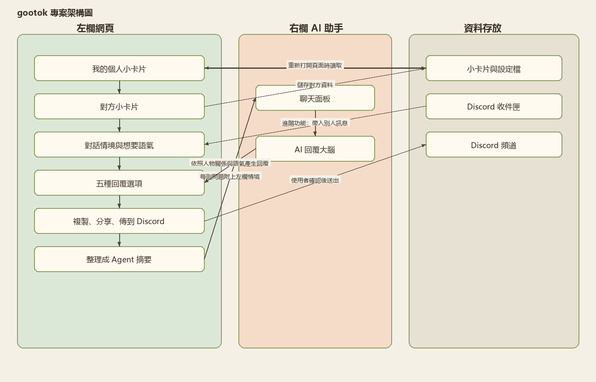
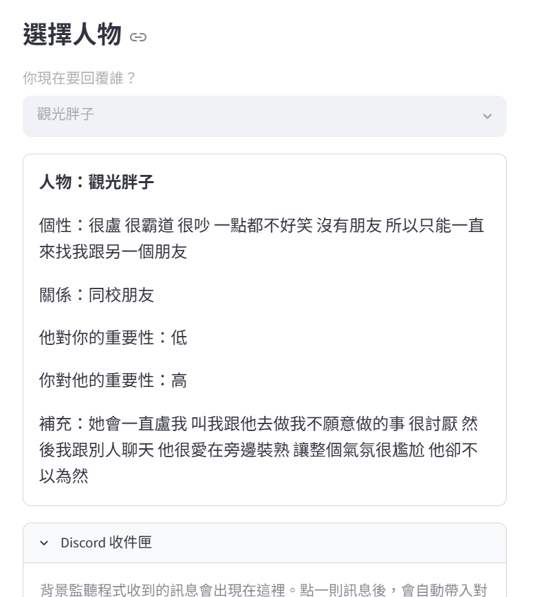
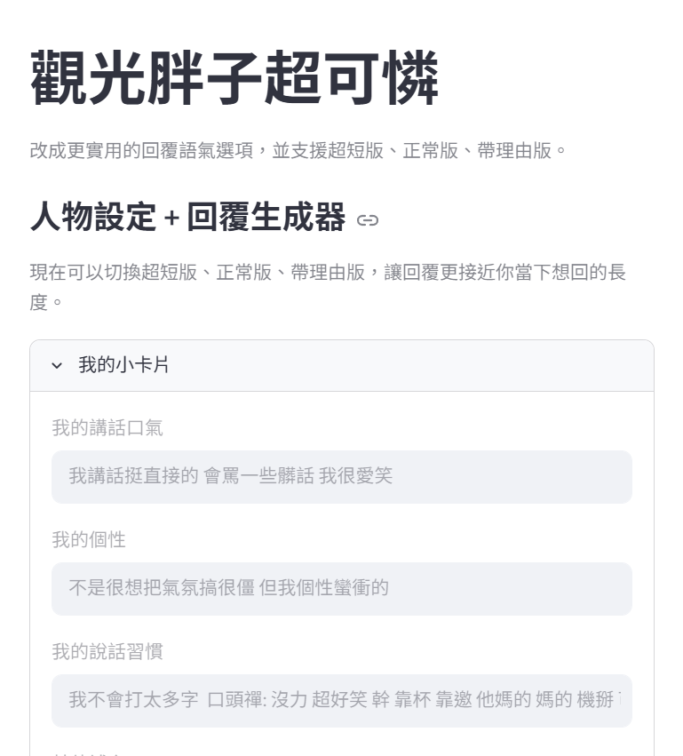

# gootok：你的回覆好幫手

**組別／組員**：個人專題
**日期**：2026-06-24

---

## 1. 專題介紹

**專題名稱**：gootok：你的回覆好幫手

**命名靈感**：gootok 的命名靈感來自 TikTok，也有 good talk 的諧音感，希望使用者每次打開 App 都能像滑短影片一樣，快速找到一句「剛好」的回覆。

**一句話說明**：這個 App 可以幫使用者快速產生不同風格的回覆句子。

**主要使用者**：遇到黏人的朋友、很煩的朋友，或是不太好意思拒絕別人的人。

**解決的問題**：當使用者不知道怎麼拒絕、怕講得太直接，或想快速回覆時，可以用 App 產生多種回覆選項，挑一句最合適的送出。

---

## 2. 學校 Server 環境

本專題透過學校提供的 API Key 呼叫 Ollama Router，由 Router 分配至後端 Ollama 節點執行 LLM。下圖為全班相同之 server 拓撲（報告不標示 Router 位址）。

---

## 3. 系統概覽

左欄 Streamlit 自訂頁與右欄 Agent 的互動如下。

### 3.1 自訂頁

- **個人小卡片**：填寫自己的講話風格、個性、習慣與補充資訊
- **他人小卡片**：記錄對方的個性、關係、重要性與補充說明
- **對話內容輸入**：輸入對方傳來的訊息，並選擇想要的回覆方式與回覆長度
- **分享功能**：把產生的回覆複製、轉發，或直接傳送到 Discord

### 3.2 資料流（左欄 ↔ Agent）

- **左欄 → Agent**：把自己的資料、對方資料、聊天內容和回覆語氣整理成摘要，送給 Agent
- **Agent → 左欄**：Agent 根據這些資料產生多個回覆選項，顯示回左欄

### 3.3 完整例子

使用者填好個人小卡片、他人小卡片和對話內容後，按下「生成 5 個回答」按鈕，Agent 產生 5 種不同語氣的回覆，左欄更新顯示這些回覆，使用者再選一個複製或傳到 Discord。

---

## 4. 成果與創新

### 4.1 成果

- 根據使用者填寫的情境與語氣，產生多種可選的回覆句
- 回覆不是只有一種，而是一次提供多個選項，讓使用者挑到滿意為止
- 產生的回覆可以直接複製，也可以轉發分享給別人
- App 也加入了直接傳送到 Discord 的功能，讓回覆可以更快送到指定頻道

### 4.2 創新／亮點

- 這個 App 不只是聊天，而是把「自己是誰、對方是誰、想用什麼語氣」一起納入回覆生成
- 和一般範例不同，它比較貼近真實人際互動，特別是「不好意思拒絕別人」這種情境
- 回覆提供多種語氣與長度選擇，使用者可以像挑選句子一樣挑出最適合當下的回覆
- Discord 傳送功能讓 App 不只停留在產生文字，也能接到實際社群平台使用

---

## 5. 技術含量

- 使用 **Agent Studio** 和 **Streamlit** 製作左欄互動介面
- 使用本機 **JSON** 資料儲存個人小卡片、他人小卡片、回覆設定與 Discord Webhook 設定
- 使用 **Agent** 依據左欄整理出的情境資料產生回覆
- 使用 **Discord Webhook** 將選定的回覆傳送到 Discord 頻道
- 另外也嘗試設計自動讀取 Discord 訊息的收件匣功能，但因為需要 Discord Bot 權限、Message Content Intent 和 token 設定，所以目前屬於較進階、需要額外權限才能完整啟用的功能

---

## 附錄：Demo 截圖

> ⚠️ 待補：截圖已截但尚未存到 `report/assets/demo-*.png`（Step 4b 進行中）

### Safe Exit Assistant（gootok 主頁）

### 觀光胖子超可憐

---

展覽用綜整海報（Step 7 另產）：`assets/專題海報.png`